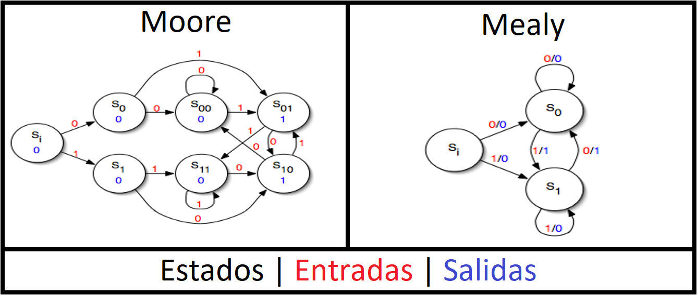

_MEF_Anti_Rebote_

# ¿Que es una MEF?

Una MEF (o FSM en inglés) es un modelo computacional, basado en la teoría de autómatas, que se utiliza para describir sistemas cuyo comportamiento depende de los eventos actuales y de los eventos que ocurrieron en el pasado. En cada instante de tiempo la máquina se encuentra en un estado, y dependiendo de las entradas, actuales y pasadas, que provienen del ambiente, la máquina cambia o no cambia de estado, y puede realizar acciones que a su vez influyen en el ambiente.

_Constituye una herramienta gráfica utilizada tradicionalmente para modelar el comportamiento de sistemas electrónicos e informáticos_

# Existen 2 tipos de implementaciones de MEF

Estos 2 tipos se diferencia en la forma en que se produce la salida.

## Moore

- La **salida** del sistema depende del **estado actual**.

- El **siguiente estado** depende de la **entrada** y del **estado actual**.

- Puede haber **múltiples estados** con la **misma salida**, pero cada uno de ellos es un estado diferente. 

## Mealy

- La **salida** depende del **estado actual** y **_la entrada_**.

- El **siguiente estado** depende de la **entrada** y del **estado actual**.

- Las **diferentes salidas** son necesarias para el **cambio de estado**.

# Transiciones de estado en una MEF

- **Tiempo:** depende solamente del paso del tiempo.

- **Tiempo-entradas:** depende del tiempo y de las entradas.

- **Entradas-Salidas:** depende de las entradas _(sensores)_ y las salidas _(actuadores)_.
